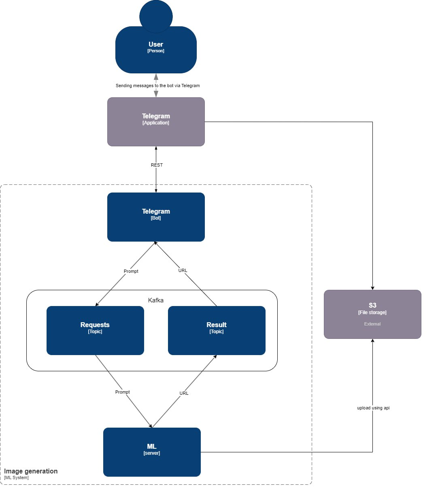

# Генерация изображений

Результат проекта телеграм бот, в котором можно в ответ на запрос подсказки получить сгенерированное изображение 

Бот развернут на Cloud.ru ID VM: c5c7c153-e79e-4ff5-a986-c6bf63463048

Тег в телеграме [@MAINeuroML_bot](t.me/MAINeuroML_bot) 

- [Презентация проекта](presentation/Prompt2Pic_raw.pdf)

## Структура проекта
- [Бот](#bot)
- [Сервер](#server)

### Телеграм Бот

- [main](/bot/app.py) - Приложение для запуск бота, подлкючается к Kafka и генерирует сообщения


### Сервер

- [server](server/Server.py) - Сервер принимает сообщения через Kafka, генерирует изображение и отправляет ответ также через Kafka

### Архитектура



### Запуск

Запускается используя Docker-compose

```
sudo docker-compose up
```

### Использование

Получившийся бот очень прост в использовании.

На данный момент в нем есть  три команды:
 “start”, “help” и “txt2img”. 

Команда “start” позволяет начать работу, а также проверить работает ли в данный момент бот.

По команде “help” бот предоставит краткое описание и подскажет как воспользоваться его главной  функцией – генерацией изображения с помощью “txt2img”.


Вы можете найти бота в Телеграм по имени - @MAINeuroML_bot
